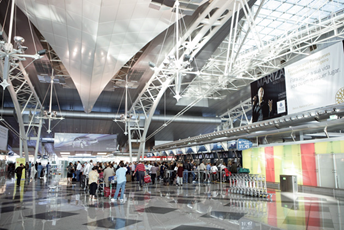
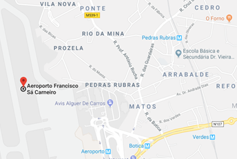

## Travel Information

The Local Organizing Committee is working to make your travel and stay as smooth and trouble-free as possible.  

In the light of the pandemic evolution and the vaccination efforts, the Portuguese Government has announced the lifting of several restrictions from August 1. Portugal has administered at least 11,852,193 doses of COVID vaccines so far (July 29, 2021). Assuming every person needs two doses, that is enough to have vaccinated about 57.7% of the country's population.  

**Nevertheless, before traveling, visitors should always confirm with airline companies and border services the procedures and restrictions in place in the country of origin and destination.**

In the meantime, please refer [here](https://reopen.europa.eu/en) for more information.  

(Information updated on July 29, 2021)  

**About Porto, the host city**

  
Since 1996, the Historic Center of Porto is listed as [UNESCO World Heritage](http://whc.unesco.org/en/list/755). Porto was elected three times as the [Best European Destination](https://www.europeanbestdestinations.com/best-of-europe/european-best-destinations-2017/), through the [European Best Destinations](https://www.europeanbestdestinations.com/) initiative (the last of which in 2017, after 2012 and 2014). This year, the city was also voted the [most interesting city in Europe](https://theculturetrip.com/europe/articles/culture-trip-wishlist-destinations-2019/) to visit by the prestigious travel platform [Culture Trip](https://theculturetrip.com/).  

You can find relevant information about the city of Porto in the following websites:  

[Visit Porto](https://visitporto.travel/en-GB/home#/)  
[Visit Porto & The North](http://www.visitportoandnorth.travel/)  
[Introducing Porto](https://www.introducingporto.com/map)  

<!--- Or by downloading the [Appy Tourist app](http://www.appytourist.pt/). Developed by the Portuguese Association for Consumer’s Right (DECO), this app allows you to enjoy your vacation or business travel to Porto without overlooking your consumer’s rights. Download is free.  -->

**How to get to the venue**

 

**From Porto Airport:**

Porto’s Francisco Sá Carneiro Airport, the second largest international airport in Portugal, was distinguished by Airports Council International as the best airport in Europe in 2018, in the category of 5 to 15 million passengers.  

Check [here](https://www.aeroportoporto.pt/en/opo/flights-destinations/airlines/airlines-and-destinations) what airlines offer flights from/to Porto.  

The airport is located approximately 10 miles / 15 kilometers away from the meeting venue and is served by several modes of public transportation.   

**Taxi and Uber: The easiest and fastest way to get to from the airport to the meeting venue and /or your hotel is by** [taxi](http://www.taxis-porto.pt/) or [Uber](https://www.uber.com/pt/en/). These are transport services that are permanently available to travelers at the airport arrivals entrance/exit. Both offer you the possibility to schedule the trip in advance or immediately after your plane lands.  
**Average fare (Taxi  one way): € 25,00**  
**Average fare (Uber one way): € 15,00**  

**Metro:** Another possibility to consider, which is cheaper than the taxi (single ticket: € 2,00), is the metro. The Airport is served by a single line (Line E - purple) that runs every 20 to 30 minutes and will take you to the historic city centre (end of line: Trindade station) in the same amount of time. When you get off at Trindade station, take Line D - yellow. See the [map](https://www.google.com/maps/dir/I.p.o.,+Porto/FEUP+-+Faculdade+de+Engenharia+da+Universidade+do+Porto,+Rua+Doutor+Roberto+Frias,+Porto/@41.1785432,-8.6054457,16z/data=!3m2!4b1!5s0xd24659f1d840a4b:0xb814d00dda93219!4m14!4m13!1m5!1m1!1s0xd246438248f9323:0xd815dd1e62b22f5b!2m2!1d-8.6045954!2d41.1812273!1m5!1m1!1s0xd246446d48922a3:0x8b1e4a0bcdacc840!2m2!1d-8.5958454!2d41.1783583!3e2). Detailed information about these and other travel options at the Porto Airport may be found [here](https://www.aeroportoporto.pt/en/opo/access-parking/getting-to-and-from-the-airport/public-transportation).  

**From Campanhã Train Station (for international visitors flying to Lisbon):**

Porto is approximately 300 kms /205 miles away from Lisbon. If you are flying to Lisbon International Airport (Humberto Delgado airport) and planning to get to Porto by train (Alfa Pendular or Intercidades) you should buy a ticket at Lisbon's Gare do Oriente Station to Campanhã Station, where you'll need to get off. Once more, the taxi or Uber is rather convenient, since the conference venue is only 8 kms or 6 miles away from Campanhã Station and the price is likely to be around € 20-25 euros.  

Detailed information about trains, timetables, journey times and ticket fares may be found [here](https://www.cp.pt/passageiros/en).

