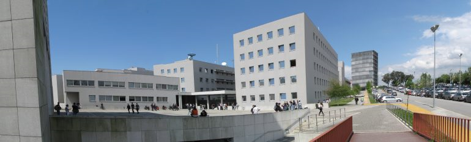
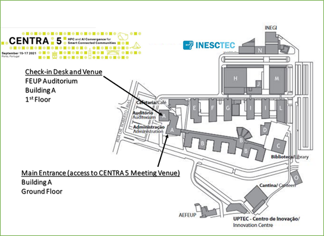
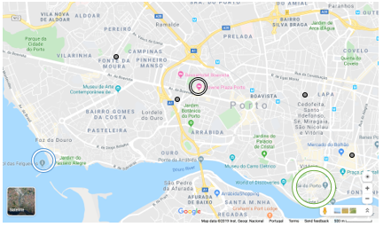

## Venue & Lodging

The CENTRA 5 Meeting will be held in a hybrid format. All sessions will be staged and live-streamed from the Faculty of Engineering of the University of Porto.  

University of Porto | Faculty of Engineering  

  
The Faculty of Engineering of the University of Porto (FEUP) was created in 1926. Still, its history began a century before within the Polytechnic Academy of Porto to "plant industry science in the country".   

The Faculty of Engineering of the University of Porto undertakes education, research, and innovation activities at the international level. The results of these activities lead to the creation and transfer of knowledge, training of competent and ethical professionals, future leaders in engineering and similar areas, and the promotion of our global society’s well-being.  

With a workforce of over 1.000 collaborators, including more than 600 teachers, FEUP offers over 90 degree and non-degree courses, which enrolled around 9.000 students in the last academic year.  
  
Source: FEUP  

  
*Photo credits:* Engenharia Radio  

  

Faculdade de Engenharia da Universidade do Porto  
Rua Dr. Roberto Frias  
4200-465 Porto  
Portugal  
41.17855261102346, -8.595838656216014  
[View map](https://goo.gl/maps/oe23e2PHBoLXRjWAA)

**Accommodation & Transfers**

The Local Organizing Committee has selected a 5-star hotel located closer to Porto's major tourist attractions for you to experience a more immersive stay in the city. CENTRA 5 Meeting's delegates are entitled to special rates in this hotel.  

To benefit from such rates, you will need to first register for the meeting. At the time of registration confirmation, you will be given a promo code that you should use when booking directly with the hotel.  

A shuttle or bus service arranged by the Local Organizing Committee will ensure all transfers between this hotel and the meeting venue.  

Please note that the Local Organizing Committee cannot be held accountable for reservations/confirmations or cancellations.  

Also keep in mind that tourist enterprises and local accommodation in Porto may charge a tourist tax of €2,00/ person per night, up to a maximum of 7 nights for reservation.  

**Please keep in mind that, due to the heterogeneous spreading of Covid-19 across the countries that make up the CENTRA community and the different responses by national governments to control it, thereby conditioning international travel, we kindly ask you to wait until August 31 for updated information on the in-person agenda.**

<!--The CENTRA 5 Meeting will be held at 5-star [Crowne Plaza Porto](https://www.crowneplaza.com/hotels/gb/en/porto/opocp/hoteldetail?fromRedirect=true&qSrt=sBR&qIta=99603195&icdv=99603195&glat=SEAR&qSlH=OPOCP&setPMCookies=true&qSHBrC=CP&qDest=Avenida%20da%20Boavista,%201466,%20Porto,%20PT&dp=true&gclid=Cj0KCQjw0IDtBRC6ARIsAIA5gWucOPW7Z8EVjFeJPhSHs0XeCu_HwkeRdnZheSz_tht79kNktzwLiqEaAqDSEALw_wcB&cid=41468&srb_u=1), in Porto, Portugal. See [map](https://www.google.com/maps/place/Crowne+Plaza+Porto/@41.1601764,-8.642862,17z/data=!3m1!4b1!4m8!3m7!1s0xd24659efd4e5e9b:0xc695ad1f002380ec!5m2!4m1!1i2!8m2!3d41.1601724!4d-8.6406733?hl=en-US&shorturl=1).

_Photo credit: Crowne Plaza Porto_  

The hotel is located right in the heart of one of the city’s main business and shopping districts (*Avenida da Boavista*), served by several bus lines and within 15-minute walking-distance from Casa da Música Metro Station.  

*Source: [Google Maps](https://www.google.pt/maps/@41.1570569,-8.6467148,14.18z)*

 Meeting venue (Crowne Plaza Porto)  
 Porto’s beachfront  
 Porto’s historic center  

The hotel is on the route of one of the hops on hops off buses that will take you in a memorable journey to some of the many must-see attractions the city has to offer travelers: the historic center of Oporto, the Clérigos Bell Tower, the Serralves Foundation and Casa da Música, two icons of the city’s contemporary architecture, or even the Porto Cruise terminal.
By taxi or Uber, you can easily and conveniently reach Porto’s historic downtown or Porto Airport in just under 20 minutes. 

**Accommodation \| List of suggested hotels:** 

We have selected a number of hotel units located either in the vicinity of the meeting venue or closer to Porto’s major tourist attractions if you wish to experience a more immersive stay in the city. The list includes a range of prices and star-ratings in order to cater for all tastes and wallets.
  
INESC TEC has negotiated special rates with these hotels. To benefit from such rates, **you will need to first register for the meeting. At the time of registration confirmation, you will be given a promo code, form or reservation link that you can use at any of the hotels on the list**.  

CENTRA 5 Meeting's Local Organizing Team will not be accountable for hotel reservations/confirmations nor cancellations.

- **For the criterion *convenience*, Crowne Plaza Porto** ranks first on our list of suggested hotels.  

[Crowne Plaza Porto](https://www.crowneplaza.com/hotels/gb/en/porto/opocp/hoteldetail?fromRedirect=true&qSrt=sBR&qIta=99603195&icdv=99603195&glat=SEAR&qSlH=OPOCP&setPMCookies=true&qSHBrC=CP&qDest=Avenida%20da%20Boavista,%201466,%20Porto,%20PT&dp=true&gclid=EAIaIQobChMI_-_QgZGc5QIVVZ3VCh0aqg4wEAAYASAAEgJX5PD_BwE&cid=41468&srb_u=1) ★★★★★  
**Address:** Avenida da Boavista, 1466, Porto | 4100-114 | Portugal  
**Phone number:** +351 226 072 500  
**Email:** opocp.events@ihg.com  
**Price:** DBL €165 and SGL €150 (breakfast incl.) 

- **Hotels in the vicinity of the venue**  

[Sheraton Porto Hotel & Spa](https://www.marriott.com/hotels/travel/oposi-sheraton-porto-hotel-and-spa/) ★★★★★  
**Address:** Rua Tenente Valadim, 146 | 4100-476 Porto | Portugal  
**Phone number:** +351 220 404 127  
**Price:** DBL €180 and SGL €160 (breakast incl.)  
**5-minute walking distance to the venue**   

[Portus Cale Hotel](http://www.portuscalehotel.com/EN/hotel.html?id_referer=ADWORDS&gclid=EAIaIQobChMI67eNrrSb5QIVg4xRCh0JwgCMEAAYASAAEgKaYPD_BwE) ★★★★  
**Address:** Avenida da Boavista, 1060 | 4100-113 Porto | Portugal  
**Phone number:** +351 226 083 900  
**Email:** reservas@portuscalehotel.com  
**Price:** DBL €94 and SGL €85 (breakfast incl.)  
**5-minute walking distance to the venue**   

[Hotel da Música](https://www.hoteldamusica.com/) ★★★★  
**Address:** Mercado do Bom Sucesso Largo Ferreira Lapa, 21 - 183 | 4150-323 Porto |  Portugal  
**Phone number:** +351 226 076 000  
**Email:** info@hoteldamusica.com or res@hoteldamusica.com  
**Price:** DBL €99 and SGL €89 (breakfast incl.). Double beds only.  
**15-minute walking distance to the venue**  

[HF Tuela Porto](https://www.hfhotels.com/hotels-en/hf-tuela-porto-en/) ★★★  
**Address:** Rua Arquitecto Marques da Silva 200 | 4150-483 Porto | Portugal  
**Phone number:** +351 226 004 747  
**Email:** hftuelaporto@hfhotels.com  
**Price:** 10% off the best value on the hotel website (breakfast incl.)  
**15-minute walking distance to the venue**  

- **Hotels near tourist attractions (Porto’s downtown  UNESCO World Heritage Site)**  

[Hotel Exe Almada Porto](https://www.exehotels.co.uk/exe-almada-porto.html?td=b10ga02&id_referer=ADWORDS&gclid=EAIaIQobChMIw7H0mrab5QIVgoxRCh38dA2FEAAYASAAEgI93PD_BwE) ★★★★  
**Address:** Rua do Almada, 361 | 4050-032 Porto | Portugal  
**Phone number:** +351 932 087 108  
**Email:** info@exealmadaporto.com  
**Price:** DBL €180 and SGL €170 (breakfast incl.). Double beds only.   
**15-minute by car to the venue**  

- **Hotels at Porto’s beachfront  Foz do Douro**  

[Hotel Boa-Vista](http://www.hotelboavista.com/en/) ★★★  
**Address:** Esplanada do Castelo, 58 | 4150-196 Porto | Portugal  
**Phone number:** +351 225 320 020  
**Email:** reserva@hotelboavista.com  
**Price:** SGL €89,10 (breakfast incl.)  
**15-minute by car to the venue**  
   

Tourist enterprises and local accommodation in Porto will charge a tourist tax of €2.00 per person per night, up to a maximum of 7 nights for reservation.  -->
