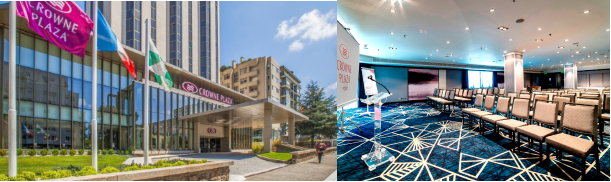

## Venue & Lodging

**Meeting Venue**

The CENTRA 5 Meeting will be held at 5-star [Crowne Plaza Porto](https://www.crowneplaza.com/hotels/gb/en/porto/opocp/hoteldetail?fromRedirect=true&qSrt=sBR&qIta=99603195&icdv=99603195&glat=SEAR&qSlH=OPOCP&setPMCookies=true&qSHBrC=CP&qDest=Avenida%20da%20Boavista,%201466,%20Porto,%20PT&dp=true&gclid=Cj0KCQjw0IDtBRC6ARIsAIA5gWucOPW7Z8EVjFeJPhSHs0XeCu_HwkeRdnZheSz_tht79kNktzwLiqEaAqDSEALw_wcB&cid=41468&srb_u=1), in Porto, Portugal.

​				Photo credit (Crowne Plaza Porto)

The hotel is located right in the heart of one of the city’s main business and shopping districts (*Avenida da Boavista*), served by several bus lines and within 15-minute walking-distance from Casa da Música Metro Station. 

**Accommodation \| List of suggested hotels:** 

The list of suggested hotels for 2021 will be updated in the coming months. 
If you have reserved a room at a hotel in Porto to attend the 2020 CENTRA 5 Meeting, do not forget to contact your hotel for assistance / cancellation.  

<!--

We have selected a number of hotel units located either in the vicinity of the meeting venue or closer to Porto’s major tourist attractions if you wish to experience a more immersive stay in the city. The list includes a range of prices and star-ratings in order to cater for all tastes and wallets.  

IINESC TEC has negotiated with these hotels special conditions (such as special rates or room block) for CENTRA 5 Meeting’s delegates (e.). 

- In order to benefit from such conditions, you will need to first register for the meeting. At the time of registration confirmation, depending on the hotel you would like to stay at, you will be given either a promo code or a reservation link that you can use to book directly with the hotel.
- Please, note that, in May, Porto is a stage for a vast array of events and attracts many tourist and business travelers. We strongly suggest that you book early your accommodation to avoid disappointment.

The Organization Team of the CENTRA 5 Meeting will be accountable neither for reservations/ confirmations nor cancellations.

**Crowne Plaza Porto**, at this point in time, is already fully booked for the 13th of May 2020. We apologize for the inconvenience. 

The situation is, however, likely to change as some group/individual reservations may be cancelled. Therefore, you can always check with the hotel whether any booked room has been released in the meantime. Also, the Local Organizing Team will go on updating this section with information about room availability at Crowne Plaza Porto. 

[Crowne Plaza Porto](https://www.crowneplaza.com/hotels/gb/en/porto/opocp/hoteldetail?fromRedirect=true&qSrt=sBR&qIta=99603195&icdv=99603195&glat=SEAR&qSlH=OPOCP&setPMCookies=true&qSHBrC=CP&qDest=Avenida%20da%20Boavista,%201466,%20Porto,%20PT&dp=true&gclid=EAIaIQobChMI_-_QgZGc5QIVVZ3VCh0aqg4wEAAYASAAEgJX5PD_BwE&cid=41468&srb_u=1) ★★★★★  
Address: Avenida da Boavista, 1466, Porto | 4100-114 | Portugal   
Price: DBL 165€ and SGL 150€ (breakfast incl.)  
<u>Event code to be provided in registration confirmation email</u>

Phone number: +351 226 072 500  
Email: opocp.info@ihg.com.  

- **Hotels in the vicinity of the venue**  

[Sheraton Porto Hotel & Spa](https://www.marriott.com/hotels/travel/oposi-sheraton-porto-hotel-and-spa/) ★★★★★  
**Address:** Rua Tenente Valadim, 146 | 4100-476 Porto | Portugal    
**Price:** DBL 180€ and SGL 160€ (breakast incl.)  
5- minute walking distance to the venue  
<u>Reservation link to be provided in registration confirmation email</u>  

Phone number: +351 220 404 127  

[Portus Cale Hotel](http://www.portuscalehotel.com/EN/hotel.html?id_referer=ADWORDS&gclid=EAIaIQobChMI67eNrrSb5QIVg4xRCh0JwgCMEAAYASAAEgKaYPD_BwE) ★★★★  
Address: Avenida da Boavista, 1060 | 04100 Porto | Portugal  
Price: DBL 147€ and SGL 138€ (breakfast incl.)  
5-minute walking distance to the venue   
<u>Reservation form to be provided in registration confirmation email</u>

Phone number: +351 226 083 900  
Email: reservas@portuscalehotel.com  

[Hotel da Música](https://www.hoteldamusica.com/) ★★★★  
Address: Mercado do Bom Sucesso Largo Ferreira Lapa, 21 a 183 | 4150-323 Porto |  Portugal  
Price: DBL 93€ and SGL 83€ (breakfast incl.). Double beds only.  
**15-minute walking distance to the venue**  
<u>Event code to be provided in registration confirmation email</u>

Phone number: +351 226 076 000  
Email: res@hoteldamusica.com  

[HF Tuela Porto](https://www.hfhotels.com/hotels-en/hf-tuela-porto-en/) ★★★  
Address: Rua Arquitecto Marques da Silva 200 | 4150-483 Porto | Portugal  
Price: 10% off the best value on the hotel website (breakfast incl.)  
15-minute walking distance to the venue  
<u>Event code to be provided in registration confirmation email</u>

Phone number: +351 226 004 747  
Email: hftuelaporto@hfhotels.com  

- **Hotels near tourist attractions (Porto’s downtown – UNESCO World Heritage Site)**  

[Hotel Exe Almada Porto](https://www.exehotels.co.uk/exe-almada-porto.html?td=b10ga02&id_referer=ADWORDS&gclid=EAIaIQobChMIw7H0mrab5QIVgoxRCh38dA2FEAAYASAAEgI93PD_BwE) ★★★★  
Address: Rua do Almada, 361|4050-032 Porto | Portugal   
Price: DBL 180€ and SGL 170€ (breakfast incl.). Double beds only.   
15-minute by car to the venue  
<u>Event code to be provided in registration confirmation email</u>

Phone number: +351 932 087 108  
Email: info@exealmadaporto.com  

- **Hotels at Porto’s beachfront – Foz do Douro**    

[Hotel Boa-Vista](http://www.hotelboavista.com/en/) ★★★  
Address: Esplanada do Castelo, 58 | 4150-196 Porto | Portugal  
Price: DBL 102,60€ and SGL 89,10€ (breakfast incl.)  
Within 10 minutes’ drive to the venue  
<u>Event code to be provided in registration confirmation email </u>

Phone number: +351 225 320 020  
Email: reserva@hotelboavista.com    

Tourist enterprises and local accommodation in Porto will charge a tourist tax of 2.00 € per person per night, up to a maximum of 7 nights for reservation. The tourist tax purpose is to minimize the difficulties that arise from the significant growth of tourism in Porto.  -->
