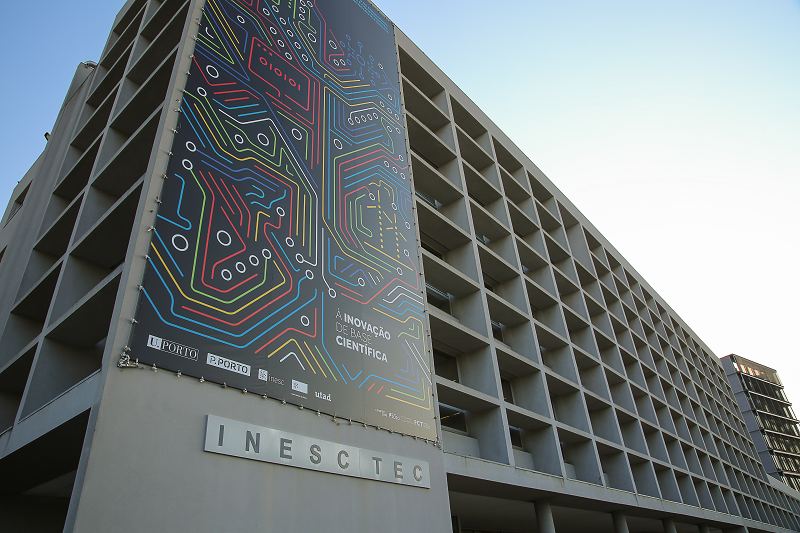
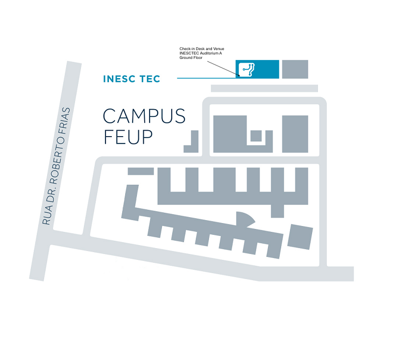

## Venue & Lodging

The CENTRA 5 Meeting will be held in a hybrid format. All sessions will be staged and live-streamed from INESC TEC  Institute for Systems and Computer Engineering, Technology and Science.  

 
 
*Photo credits:* INESCTEC  
  
INESC TEC is a private non-profit research association, with Public Interest status, dedicated to scientific research and technological development, technology transfer, advanced consulting and training, and pre-incubation of new technology-based companies.  

As an institution operating at the interface of the academic and business worlds, bringing closer together academia, companies, public administration, and society, INESC TEC typically applies the knowledge and results generated as part of its research in technology transfer projects, seeking value creation and immediate social relevance.  

INESC TEC hosts over 700 integrated researchers (about 350 PhDs), including staff researchers, researchers from Higher Education Institutions, grant holders and affiliated researchers. INESC TEC’s team also includes trainees, and technical and administrative support staff.  

Source: INESC TEC  

  

INESC TEC  
Rua Dr. Roberto Frias  
4200-465 Porto  
Portugal  
41.17968, -8.59510  
[View map](https://www.google.com/maps/place/INESC+TEC+-+Institute+for+Systems+and+Computer+Engineering,+Technology+and+Science/@41.1794332,-8.5975957,17z/data=!3m1!4b1!4m5!3m4!1s0xd246440cf4b8787:0x4969a3392daad2eb!8m2!3d41.1794059!4d-8.5954106)

**Accommodation & Transfers**

The Local Organizing Committee has selected a 5-star hotel located closer to Porto's major tourist attractions for you to experience a more immersive stay in the city. CENTRA 5 Meeting's delegates are entitled to special rates in this hotel.  

To benefit from such rates, you will need to first register for the meeting. At the time of registration confirmation, you will be given a promo code that you should use when booking directly with the hotel.  

A shuttle or bus service arranged by the Local Organizing Committee will ensure all transfers between this hotel and the meeting venue.  

Please note that the Local Organizing Committee cannot be held accountable for reservations/confirmations or cancellations.  

Also keep in mind that tourist enterprises and local accommodation in Porto may charge a tourist tax of €2,00/ person per night, up to a maximum of 7 nights for reservation.  

